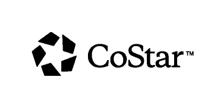

# DC JavaScript (DCJS) Meetup Organizing

This repository holds information from the DCJS meetup organizing crew. We'll place information here about our history, structure, plans, policies, and anything else relevant to how we run these events and this community.

## What is DCJS?

The DCJS meetup brings JavaScript developers from around the DC area (including Northern Virginia and Southern Maryland) together to learn, network, and socialize. We hold monthly tech talks on the second Thursday.

You can see all of our events, past and upcoming, on our [meetup page](https://www.meetup.com/DC-JavaScript).

### Code of Conduct

We are currently developing a code of conduct for our members, visitors, volunteers, and organizers to ensure that DCJS is a safe, respectful environment. Stay tuned for more very soon.

### Our Sponsor(s)

Big thanks to our current sponsor: [CoStar Group](http://www.costar.com/)! Our sponsors

### Interested in Sponsoring?

The DCJS meetup is always looking for sponsors and happy to find a way for your organization to help. We can custom tailor a package that gets you exposure to our 2600+ member group. Reach out to us either through a [meetup message](https://www.meetup.com/DC-JavaScript/members/?op=leaders) or with an [issue on this GitHub repository](https://github.com/dcjs/talks/issues)!

## Who's involved?

Right now the organizing crew includes four people (in order of most letters in their last name):

* Greg Lavallee
* Asa Baylus
* Jordan Kasper
* Liza Floyd

### Can I help?

Yes! We are always open to others helping out! There are plenty of things to do and ways you can contribute. Please [add an issue](https://github.com/dcjs/organizing/issues) to the repository if you want to talk about it. If you want a less public setting, [send us a message on meetup.com](https://www.meetup.com/DC-JavaScript/members/?op=leaders)!
